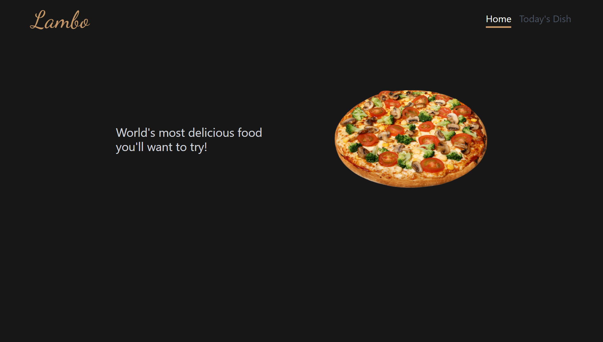
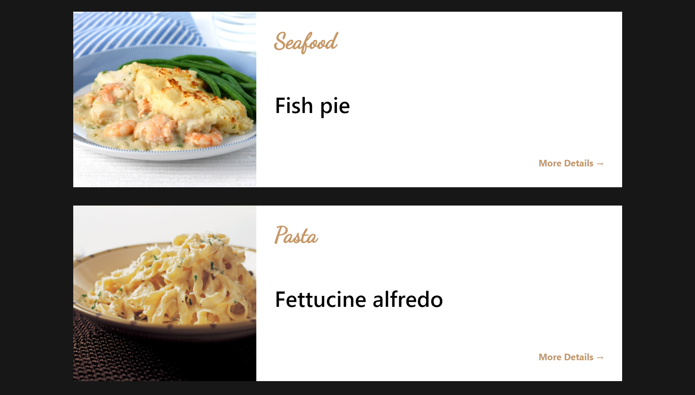
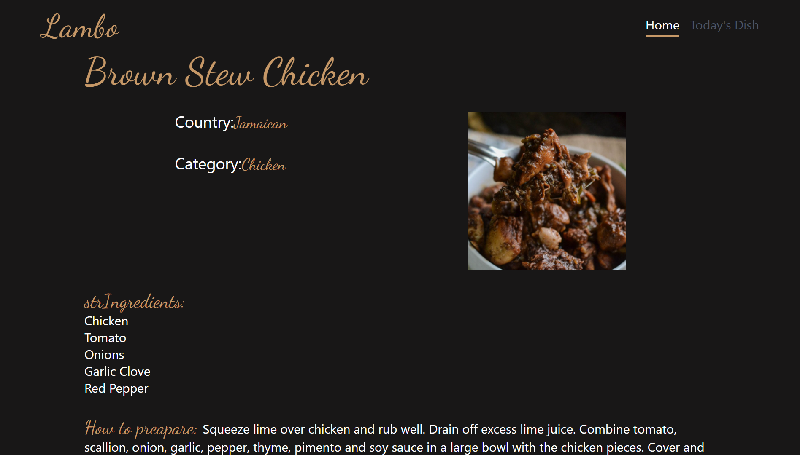

# Lambo Recipies

Recipies of my favorite categories of food. You can filter through Chicken, Pasta, and Seafood dishes. You navigate to a certain dish to know about the ingredients and how to prepare it.

- Hero Section.

- Meals that you can filter. 

- ingredients and how to prepare the meal.

### Live Demo

[Live Demo](https://lambo-res.herokuapp.com/).


## Built With 🔨
- React
- Redux Toolkit
- Tailwind CSS

## Run tests 🔨
```sh
   npm run test
```


## Getting Started 💻

## Installation

To get a local copy of the repository please run the following commands on your terminal:

1. Clone the repo
   ```sh
   git clone https://github.com/omar-labana/lambo.git
   ```
2. Install NPM packages
   ```sh
   npm install
   ```
3. Run dev server
    ```sh
      npm run start
    ```
4. navigato to http://localhost:3000/ in your brwoser

## 👤 Author

👤 **Omar Labana**

- Github: [@omarlabana](https://github.com/omar-labana)
- Twitter: [@panda4cs](https://twitter.com/panda4cs)
- Linkedin: [Omar Labana](https://www.linkedin.com/in/omar-labana/)

## 🤝 Contributing

Contributions, issues and feature requests are welcome!

## Show your support

Give a ⭐️ if you like this project!
